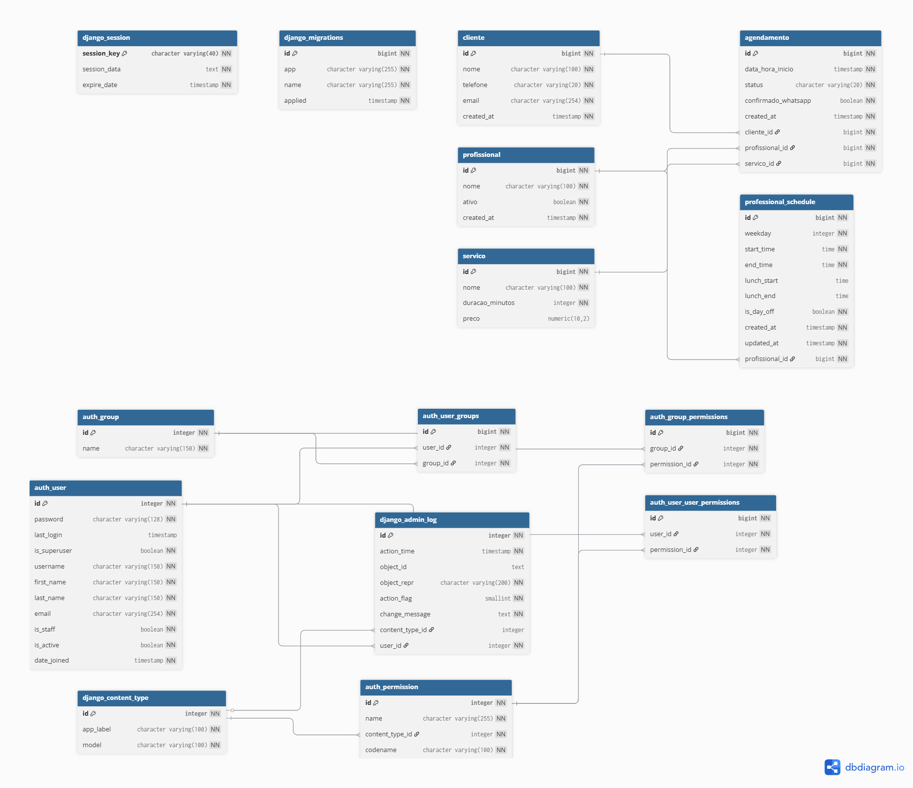

# 💈 PI Barbearia

Sistema completo de agendamento online para barbearias, desenvolvido com Django.

---

## 📌 Sobre o Projeto

O **PI Barbearia** é uma aplicação web que permite o gerenciamento completo de agendamentos, profissionais, clientes e serviços em uma barbearia.

O sistema foi projetado para:

- 📅 Automatizar agendamentos
- 👤 Gerenciar clientes e profissionais
- ⏱️ Controlar disponibilidade de horários
- 📊 Organizar o fluxo de atendimento
- ✉️ Notificar clientes por e-mail automaticamente

---

## 🧠 Funcionalidades

### 👤 Cliente
- Login simplificado por telefone
- Criar agendamentos
- Visualizar agendamentos
- Atualizar dados pessoais

### 🛠️ Administração
- Dashboard administrativo
- CRUD completo de:
  - Clientes
  - Profissionais
  - Serviços
  - Agendamentos
- Controle total do sistema

### ⏰ Sistema de Disponibilidade
- Cálculo automático de horários disponíveis
- Considera:
  - Escala do profissional
  - Horário de almoço
  - Duração do serviço
  - Agendamentos existentes

### ✉️ Sistema de Notificações por E-mail
- **Confirmação de agendamento** — enviada automaticamente ao cliente quando um novo agendamento é criado (status `AGENDADO`)
- **Lembrete do dia** — enviado toda manhã às 08:00 BRT para agendamentos do dia (`AGENDADO` ou `CONFIRMADO`)
- Canal: **Gmail SMTP** (gratuito, nativo ao Django)
- Todos os envios são registrados em `NotificacaoLog` (visível no painel admin)
- Lembrete diário executado por Cron Job no Render (zero custo adicional)

---

## 🏗️ Arquitetura

- **Framework**: Django 5+
- **Arquitetura**: Monolito (MVT)
- **Padrões utilizados**:
  - Class-Based Views (CBV)
  - Services Layer
  - Mixins de autenticação

---

## 🗄️ Banco de Dados

### Diagrama ER



> 🔗 [Visualizar diagrama interativo no dbdiagram.io](https://dbdiagram.io/d/mer-pi-barbearia-69c4953878c6c4bc7a6dd011)

### Principais tabelas

| Tabela | Descrição |
|--------|-----------|
| `cliente` | Clientes cadastrados na barbearia |
| `profissional` | Barbeiros/profissionais ativos |
| `servico` | Serviços oferecidos com duração e preço |
| `agendamento` | Agendamentos vinculando cliente, profissional e serviço |
| `professional_schedule` | Grade de horários semanais por profissional |
| `notificacao_log` | Histórico de todos os e-mails enviados pelo sistema |

---

## 📂 Estrutura do Projeto

```

├── config/             # Configurações do Django
├── apps/
│   ├── core/           # Autenticação e dashboards
│   ├── clientes/       # Gestão de clientes
│   ├── profissionais/  # Profissionais e escalas
│   ├── servicos/       # Catálogo de serviços
│   ├── agendamentos/   # Lógica principal de agendamento
│   └── notificacoes/   # Notificações por e-mail
│       ├── models.py           # NotificacaoLog
│       ├── services.py         # NotificacaoService
│       ├── admin.py            # Painel de logs
│       └── management/
│           └── commands/
│               └── enviar_lembretes.py  # Cron job de lembretes
├── templates/          # Templates HTML (inclui e-mails)
├── static/             # CSS e assets
├── requirements/       # Dependências por ambiente
├── manage.py
└── render.yaml         # Deploy (web + cron job)

````

---

## 🔐 Autenticação

O sistema possui dois tipos de acesso:

- 👤 **Cliente**
  - Login via telefone (sem senha)
  - Sessão personalizada

- 🛠️ **Administrador**
  - Login padrão Django (email + senha)
  - Acesso total ao sistema

---

## ⚙️ Tecnologias

- Python 3.x
- Django
- PostgreSQL (produção)
- SQLite (desenvolvimento)
- Gunicorn
- WhiteNoise
- Render (deploy)

---

## 🚀 Como Rodar o Projeto

### 1. Clonar repositório

```bash
git clone <url-do-repositorio>
cd nome-do-projeto
````

---

### 2. Criar ambiente virtual

```bash
python -m venv venv
source venv/bin/activate  # Linux/Mac
venv\Scripts\activate     # Windows
```

---

### 3. Instalar dependências

```bash
pip install -r requirements/dev.txt
```

---

### 4. Configurar variáveis de ambiente

Copie o arquivo de exemplo e preencha os valores:

```bash
cp .env.example .env
```

```env
# Django
SECRET_KEY=sua-chave-secreta
DEBUG=True
ALLOWED_HOSTS=127.0.0.1,localhost
DATABASE_URL=sqlite:///db.sqlite3
TIME_ZONE=America/Sao_Paulo

# Notificações por E-mail (Gmail SMTP)
EMAIL_HOST_USER=seuemail@gmail.com
EMAIL_HOST_PASSWORD=xxxx-xxxx-xxxx-xxxx  # App Password do Google
DEFAULT_FROM_EMAIL=seuemail@gmail.com
BAREBARIA_NOME=Minha Barbearia
```

> 💡 Em desenvolvimento, os e-mails são exibidos no terminal (sem precisar de Gmail real). Apenas em produção o SMTP é utilizado.

---

### 5. Aplicar migrações

```bash
python manage.py migrate
```

---

### 6. Criar superusuário

```bash
python manage.py createsuperuser
```

---

### 7. Rodar servidor

```bash
python manage.py runserver
```

---

### 8. Acessar sistema

* App: [http://127.0.0.1:8000/](http://127.0.0.1:8000/)
* Admin Django: [http://127.0.0.1:8000/admin/](http://127.0.0.1:8000/admin/)
* Painel Admin: [http://127.0.0.1:8000/login-admin/](http://127.0.0.1:8000/login-admin/)

---

## 🔗 API de Disponibilidade

Endpoint:

```
GET /agendamentos/availability/
```

Parâmetros:

* `professional_id`
* `service_id`

Retorna:

* horários disponíveis com base nas regras do sistema

---

## ✉️ Notificações por E-mail

### Como funciona

| Momento | Gatilho | Descrição |
|---------|---------|----------|
| Criação | Agendamento salvo com status `AGENDADO` | E-mail com detalhes do agendamento enviado automaticamente via Django Signal |
| Lembrete | Todo dia às 08:00 BRT (Cron Job) | E-mail de lembrete para todos os agendamentos do dia |

### Configurar Gmail SMTP

1. Ative o **2FA** na sua conta Google: [myaccount.google.com/security](https://myaccount.google.com/security)
2. Gere uma **App Password** em: [myaccount.google.com/apppasswords](https://myaccount.google.com/apppasswords)
3. Preencha as variáveis `EMAIL_HOST_USER` e `EMAIL_HOST_PASSWORD` no `.env`

### Testar o lembrete manualmente

```bash
python manage.py enviar_lembretes
```

### Logs de notificação

Todos os envios (sucesso ou falha) são registrados na tabela `notificacao_log` e visíveis em:

```
http://127.0.0.1:8000/admin/notificacoes/notificacaolog/
```

### Deploy (Render)

O `render.yaml` já inclui um **Cron Job** configurado para rodar `python manage.py enviar_lembretes` diariamente às 08:00 BRT. Adicione as variáveis de e-mail no painel do Render para ativá-lo.

---

## 📈 Status do Projeto

✅ Funcional
✅ Sistema de notificações por e-mail implementado
🚀 Pronto para deploy em produção

---

## 💡 Próximos Passos

* Notificações via WhatsApp (canal adicional, quando aplicável)
* Interface mais interativa (JavaScript)
* Sistema de pagamentos

---

## 📄 Licença

Este projeto é de uso acadêmico / educacional.

---

## 👨‍💻 Autor

Desenvolvido por **Paulo Feitor**