# Arquitetura — Barbearia Agendamento Web

## Diagrama de Arquitetura

```mermaid
graph TD
    %% ─── CLIENT LAYER ───────────────────────────────────────────────
    subgraph CL["🌐 Client Layer"]
        BROWSER["Browser\n(HTML + CSS + JS)"]
        ADMIN_USER["Administrador\n(staff / superuser)"]
        CLIENTE_USER["Cliente\n(login por telefone)"]
    end

    %% ─── DEPLOYMENT / INFRASTRUCTURE ────────────────────────────────
    subgraph INFRA["☁️ Infraestrutura — Render.com"]
        GUNICORN["Gunicorn\n(WSGI Server)"]
        WHITENOISE["WhiteNoise\n(Static Files Middleware)"]
    end

    %% ─── DJANGO APPLICATION LAYER ───────────────────────────────────
    subgraph DJANGO["⚙️ Django Application Layer"]

        %% --- URL Router ---
        ROOT_URLS["config/urls.py\n(Router Raiz)"]

        %% ── App: core ──────────────────────────────────
        subgraph APP_CORE["App: core"]
            CORE_VIEWS["Views\n• HomeView (TemplateView)\n• ClienteLoginView (FormView)\n• ClienteLogoutView\n• AdminLoginView (FormView)\n• AdminLogoutView\n• AdminDashboardView (TemplateView)\n• permission_denied [FBV]"]
            CORE_BACKENDS["Auth Backends\n• TelefoneBackend\n• AdminEmailBackend"]
            CORE_MIXINS["Mixins\n• ClienteRequiredMixin\n• AdminRequiredMixin\n• ClienteQuerySetMixin\n• AdminOrClienteMixin"]
            CORE_FORMS["Forms\n• ClienteLoginForm\n• AdminLoginForm"]
            BOOTSTRAP_CMD["Management Command\n• bootstrap.py"]
        end

        %% ── App: clientes ──────────────────────────────
        subgraph APP_CLIENTES["App: clientes"]
            CLI_VIEWS["Views (CBV)\n• ClienteListView\n• ClienteCreateView\n• ClienteUpdateView\n• ClienteDeleteView\n• ClienteMeusDadosView"]
            CLI_FORMS["Forms\n• ClienteForm"]
        end

        %% ── App: profissionais ─────────────────────────
        subgraph APP_PROF["App: profissionais"]
            PROF_VIEWS["Views (CBV)\n• ProfissionalListView\n• ProfissionalCreateView\n• ProfissionalUpdateView\n• ProfissionalDeleteView"]
            PROF_FORMS["Forms\n• ProfissionalForm"]
        end

        %% ── App: servicos ──────────────────────────────
        subgraph APP_SERV["App: servicos"]
            SERV_VIEWS["Views (CBV)\n• ServicoListView\n• ServicoCreateView\n• ServicoUpdateView\n• ServicoDeleteView"]
            SERV_FORMS["Forms\n• ServicoForm"]
        end

        %% ── App: agendamentos ──────────────────────────
        subgraph APP_AGEND["App: agendamentos"]
            AGEND_VIEWS["Views (CBV + FBV)\n• AgendamentoListView\n• AgendamentoCreateView\n• AgendamentoDeleteView\n• MeusAgendamentosView\n• confirmar_agendamento [FBV]\n• cancelar_agendamento [FBV]\n• availability_api_view [FBV]\n• simple_final_availability [FBV]"]
            AGEND_SERVICE["AvailabilityService\n(services.py)\n• get_available_slots()\n• _get_busy_intervals()\n• _subtract_intervals()\n• clear_availability_cache()"]
            AGEND_SIGNALS["Signals\n(signals.py)\n• post_save → clear_cache\n• post_delete → clear_cache"]
            AGEND_FORMS["Forms\n• AgendamentoForm"]
        end

        %% ── App: notificacoes ──────────────────────────
        subgraph APP_NOT["App: notificacoes ⚠️"]
            NOT_STUB["[stub — sem models\nnin views implementadas]"]
        end

        %% ── Django Contrib ─────────────────────────────
        subgraph CONTRIB["Django Contrib"]
            DJANGO_ADMIN["django.contrib.admin"]
            DJANGO_AUTH["django.contrib.auth"]
            DJANGO_SESSIONS["django.contrib.sessions"]
        end

        %% ── Templates ──────────────────────────────────
        TEMPLATES["Templates\n(DTL — Django Template Language)\ntemplates/\n  base.html\n  core/ clientes/ profissionais/\n  servicos/ agendamentos/"]

    end

    %% ─── DATA LAYER ─────────────────────────────────────────────────
    subgraph DATA["🗄️ Data Layer"]

        subgraph DB["Banco de Dados (dj-database-url)"]
            SQLITE["SQLite\n(dev/padrão)"]
            POSTGRES["PostgreSQL\n(prod — Render.com)"]
        end

        subgraph CACHE["Cache (Django Cache Framework)"]
            MEM_CACHE["LocMemCache\n(padrão — sem config explícita)\n• Chave: availability_{prof}_{serv}_{page}\n• TTL: 300 s"]
        end

        subgraph MODELS["Modelos"]
            M_CLIENTE["Cliente\n─────────\nnome: CharField\ntelefone: CharField (unique)\nemail: EmailField (unique)\ncreated_at: DateTimeField\n[db_table: cliente]"]
            M_PROFISSIONAL["Profissional\n─────────\nnome: CharField\nativo: BooleanField\ncreated_at: DateTimeField\n[db_table: profissional]"]
            M_SCHEDULE["ProfessionalSchedule\n─────────\nprofissional: FK→Profissional\nweekday: IntegerField (0-6)\nstart_time / end_time: TimeField\nlunch_start / lunch_end: TimeField\nis_day_off: BooleanField\n[db_table: professional_schedule]\n[unique_together: profissional+weekday]"]
            M_SERVICO["Servico\n─────────\nnome: CharField\nduracao_minutos: PositiveIntegerField\npreco: DecimalField (nullable)\n[db_table: servico]"]
            M_AGENDAMENTO["Agendamento\n─────────\ndata_hora_inicio: DateTimeField\nstatus: CharField (choices)\nconfirmado_whatsapp: BooleanField\ncreated_at: DateTimeField\ncliente: FK→Cliente\nprofissional: FK→Profissional\nservico: FK→Servico\n[db_table: agendamento]\n[indexes: data_hora, status, prof+data]"]
        end

        subgraph STATIC_FILES["Static Files"]
            STATIC_DIR["static/ (fonte)\nstaticfiles/ (collectstatic)\nServidos por WhiteNoise"]
        end

    end

    %% ─── EXTERNAL SERVICES ───────────────────────────────────────────
    subgraph EXT["🔗 Serviços Externos"]
        RENDER["Render.com\n(PaaS hosting)"]
        WHATSAPP_FIELD["WhatsApp [?]\n(campo confirmado_whatsapp\nexiste no model, mas sem\nintegração implementada)"]
        EMAIL_NOT["E-mail / Notificações [?]\n(app notificacoes existe\nsem implementação)"]
    end

    %% ─── MIDDLEWARE STACK ────────────────────────────────────────────
    subgraph MW["🔒 Middleware Stack"]
        MW1["SecurityMiddleware"]
        MW2["WhiteNoiseMiddleware"]
        MW3["SessionMiddleware"]
        MW4["CommonMiddleware"]
        MW5["CsrfViewMiddleware"]
        MW6["AuthenticationMiddleware"]
        MW7["MessageMiddleware"]
        MW8["XFrameOptionsMiddleware"]
    end

    %% ─── SETTINGS ───────────────────────────────────────────────────
    subgraph SETTINGS["⚙️ Settings (split)"]
        S_BASE["config/settings/base.py\n(base compartilhada)"]
        S_DEV["config/settings/dev.py\nDEBUG=True"]
        S_PROD["config/settings/prod.py\nDEBUG=False\nSSL/CSRF/Session secure cookies"]
    end

    %% ─── EDGES ───────────────────────────────────────────────────────

    BROWSER --> GUNICORN
    GUNICORN --> MW1
    MW1 --> MW2
    MW2 --> MW3
    MW3 --> MW4
    MW4 --> MW5
    MW5 --> MW6
    MW6 --> MW7
    MW7 --> MW8
    MW8 --> ROOT_URLS

    ROOT_URLS --> APP_CORE
    ROOT_URLS --> APP_CLIENTES
    ROOT_URLS --> APP_PROF
    ROOT_URLS --> APP_SERV
    ROOT_URLS --> APP_AGEND
    ROOT_URLS --> CONTRIB

    APP_CORE --> CORE_VIEWS
    CORE_VIEWS --> CORE_BACKENDS
    CORE_VIEWS --> CORE_MIXINS
    CORE_VIEWS --> TEMPLATES

    APP_CLIENTES --> CLI_VIEWS
    CLI_VIEWS --> CORE_MIXINS
    CLI_VIEWS --> TEMPLATES

    APP_PROF --> PROF_VIEWS
    PROF_VIEWS --> TEMPLATES

    APP_SERV --> SERV_VIEWS
    SERV_VIEWS --> TEMPLATES

    APP_AGEND --> AGEND_VIEWS
    AGEND_VIEWS --> AGEND_SERVICE
    AGEND_VIEWS --> AGEND_SIGNALS
    AGEND_VIEWS --> CORE_MIXINS
    AGEND_VIEWS --> TEMPLATES
    AGEND_SERVICE --> MEM_CACHE

    AGEND_SIGNALS --> MEM_CACHE

    CORE_BACKENDS --> M_CLIENTE
    CORE_BACKENDS --> DJANGO_AUTH

    M_AGENDAMENTO -->|FK| M_CLIENTE
    M_AGENDAMENTO -->|FK| M_PROFISSIONAL
    M_AGENDAMENTO -->|FK| M_SERVICO
    M_SCHEDULE -->|FK| M_PROFISSIONAL

    AGEND_SERVICE --> M_PROFISSIONAL
    AGEND_SERVICE --> M_SCHEDULE
    AGEND_SERVICE --> M_AGENDAMENTO
    AGEND_SERVICE --> M_SERVICO

    CLI_VIEWS --> M_CLIENTE
    PROF_VIEWS --> M_PROFISSIONAL
    SERV_VIEWS --> M_SERVICO
    AGEND_VIEWS --> M_AGENDAMENTO

    M_CLIENTE --> DB
    M_PROFISSIONAL --> DB
    M_SCHEDULE --> DB
    M_SERVICO --> DB
    M_AGENDAMENTO --> DB

    WHITENOISE --> STATIC_DIR
    MW2 --- WHITENOISE

    RENDER --> GUNICORN
    S_PROD --> RENDER

    S_BASE --> S_DEV
    S_BASE --> S_PROD
```

---

## Legenda dos Componentes

| Símbolo / Rótulo | Significado |
|---|---|
| `CBV` | Class-Based View (herda de `ListView`, `CreateView`, etc.) |
| `FBV` | Function-Based View (decorada com `@require_GET` / `@require_POST`) |
| `FK →` | ForeignKey (relação N:1) |
| `[?]` | Componente referenciado no código mas **sem implementação** completa |
| `[stub]` | App criada mas sem models, views ou URLs funcionais |
| `AdminRequiredMixin` | Exige `request.user.is_staff == True` via Django Auth |
| `ClienteRequiredMixin` | Exige `cliente_id` na `request.session` (autenticação própria) |
| `AvailabilityService` | Serviço de domínio puro (sem HTTP); calcula slots livres |
| `LocMemCache` | Cache em memória do processo — padrão do Django, não persiste entre workers |
| `dj-database-url` | Lê `DATABASE_URL` do ambiente; SQLite local, PostgreSQL em prod |
| `WhiteNoise` | Serve arquivos estáticos diretamente do Gunicorn (sem Nginx) |
| `Render.com` | PaaS de deploy configurado via `render.yaml` |

---

## Resumo da Arquitetura (≤ 200 palavras)

A aplicação segue o padrão **Monolítico MVC/MVT** do Django, sem nenhuma separação de front-end (SPA) ou API REST completa. O código é organizado em **seis Django apps** agrupados sob o diretório `apps/`, com responsabilidades bem delimitadas por domínio de negócio (*clientes*, *profissionais*, *servicos*, *agendamentos*, *core*, *notificacoes*).

A **camada de autenticação é dupla e customizada**: clientes fazem login por telefone usando sessão HTTP pura (`cliente_id` na session), enquanto administradores usam o sistema `django.contrib.auth` com um backend personalizado de email/senha. Mixins centralizados em `core.mixins` controlam o acesso nas views.

A **lógica de negócio mais complexa** — cálculo de disponibilidade — está encapsulada em `AvailabilityService` (padrão Service Layer), que usa o cache Django para reduzir queries repetidas, com invalidação automática via **Django Signals**.

Em produção, a aplicação roda no **Render.com** (Gunicorn + WhiteNoise), com PostgreSQL via `DATABASE_URL`. Os settings são divididos em `base/dev/prod`, usando `python-decouple` para configuração por variáveis de ambiente.

---

## Riscos Arquiteturais e Observações

| # | Categoria | Observação |
|---|---|---|
| 1 | 🔴 **Cache em memória por processo** | `LocMemCache` (padrão Django) **não é compartilhado entre workers Gunicorn**. Com múltiplos processos em prod, cada worker terá seu próprio cache, causando inconsistências. Substituir por Redis ou Memcached. |
| 2 | 🔴 **App `notificacoes` vazia** | O app está no `INSTALLED_APPS` mas não possui models, views nem URLs. O campo `confirmado_whatsapp` no model `Agendamento` sugere integração futura não implementada — risco de inconsistência de dados. |
| 3 | 🟡 **Proliferação de arquivos `views_*.py`** | O app `agendamentos` contém 11 arquivos de views alternativos (`views_debug.py`, `views_fixed.py`, `views_final.py`, etc.) — claramente resíduos de iterações de desenvolvimento. Isso aumenta a carga cognitiva e o risco de usar o arquivo errado. |
| 4 | 🟡 **Autenticação de cliente via sessão HTTP pura** | O `Cliente` não é um `User` do Django. A sessão usa apenas `cliente_id`. Isso impede usar `@login_required`, o Django Admin padrão e frameworks de permissão — exige manutenção de lógica de auth paralela. |
| 5 | 🟡 **Proteção incompleta no app `profissionais`** | As views de `profissionais` usam `LoginRequiredMixin` (Django padrão) em vez de `AdminRequiredMixin`. Um cliente autenticado via sessão (`cliente_id`) **não** satisfaz `LoginRequiredMixin`, mas a inconsistência com o restante das views admin pode causar confusão. |
| 6 | 🟡 **Sem paginação/limitação no `AvailabilityService`** | O método `_has_availability_after` itera 14 dias no futuro com chamadas DB para cada dia sem cache. Pode ser lento para profissionais muito ocupados ou com agenda vazia. |
| 7 | 🟢 **Boa separação de concerns** | O uso de Service Layer (`AvailabilityService`), Signals para cache invalidation e Mixins reutilizáveis demonstra boas práticas para uma aplicação de porte acadêmico/small-business. |
| 8 | 🟢 **Deploy bem configurado** | `render.yaml` com `preDeployCommand: migrate`, `collectstatic` no build e `SECURE_PROXY_SSL_HEADER` em `prod.py` indicam configuração de produção adequada. |
| 9 | 🔵 **Sem testes de integração / E2E** | Existem arquivos `tests.py` e `test_services.py`, mas a maioria dos apps tem arquivos de teste vazios. Cobertura de testes é desconhecida. |
| 10 | 🔵 **Sem CI/CD explícito** | Não há `.github/workflows` ou configuração equivalente. O deploy é manual/automático via Render. |
